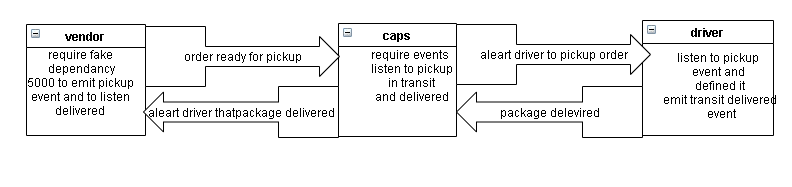

# caps
Pull Request
https://github.com/dana-younis/caps/pull/1
# Overview and Description
This is an application that logs events for client orders, driver pick ups, and deliveries using false data from the Node package Faker and logs them to the console at predefined time intervals using Node.js's built-in event emitter capability.
# uml
